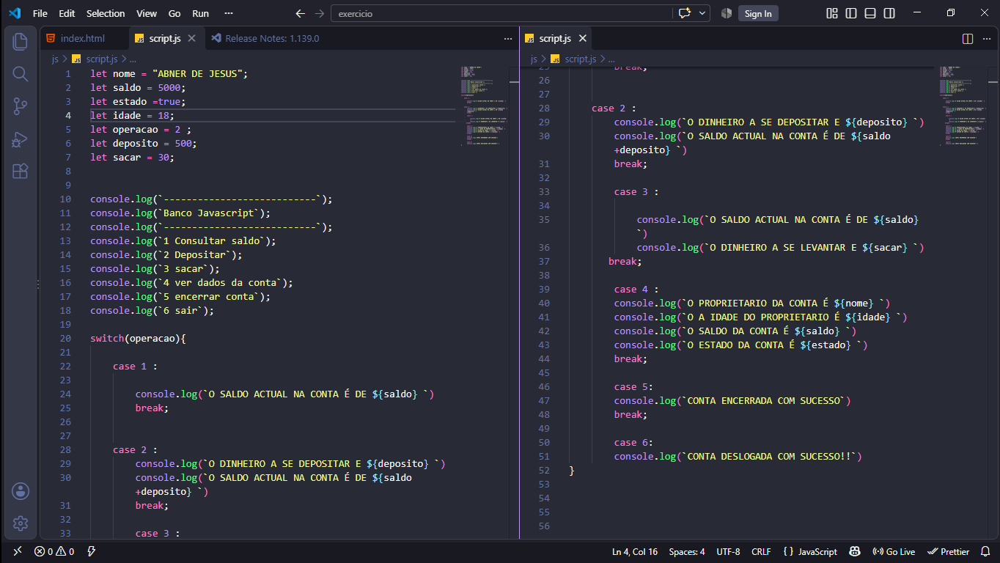

# learning-js

  

# JavaScript — Learning Journey

## Sobre o projeto

Este repositório documenta minha jornada de aprendizado e evolução com **JavaScript**.

O objetivo é construir uma base sólida na linguagem enquanto desenvolvo, na prática, habilidades essenciais para a carreira de desenvolvimento de software, como **raciocínio lógico, resolução de problemas, organização de código e capacidade de transformar ideias em soluções funcionais**.

Ao longo do processo, reúno exercícios, desafios, experimentos e pequenos projetos desenvolvidos para colocar em prática os conceitos estudados.

## Minha jornada

Minha aprendizagem em JavaScript começou pelos fundamentos da linguagem e vem evoluindo gradualmente para conceitos mais avançados. Durante esse processo, estudo não apenas como escrever código, mas também como entender o comportamento da linguagem, analisar problemas e encontrar diferentes formas de construir uma solução.

Entre os conceitos trabalhados estão fundamentos, operadores, estruturas condicionais, loops, arrays, funções, arrow functions, recursão, closures, manipulação do DOM e eventos.

Cada etapa representa uma parte da minha evolução e serve como base para os próximos desafios.

## Aprendizado na prática

Este repositório não é apenas uma coleção de códigos de estudo. A proposta é utilizar cada conceito aprendido em situações práticas, através de exercícios, desafios e pequenos projetos.

Acredito que a evolução como desenvolvedor acontece quando o conhecimento deixa de ser apenas teoria e passa a ser aplicado na construção de soluções.

Por isso, este projeto está em constante atualização conforme avanço nos meus estudos.

## Objetivo

Meu objetivo com JavaScript é desenvolver uma compreensão sólida da linguagem e utilizá-la como uma das principais bases da minha formação como desenvolvedor **Full-Stack Web & Mobile**.

Depois de fortalecer meu conhecimento em JavaScript, pretendo avançar para tecnologias como **React**, além de continuar minha formação no desenvolvimento de aplicações web e mobile.

> **Learn. Practice. Build. Improve.**

Este repositório representa cada etapa desse processo e continuará evoluindo junto comigo.

